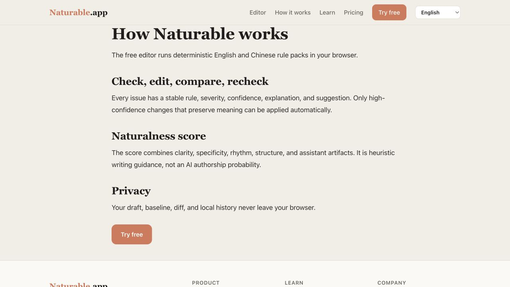
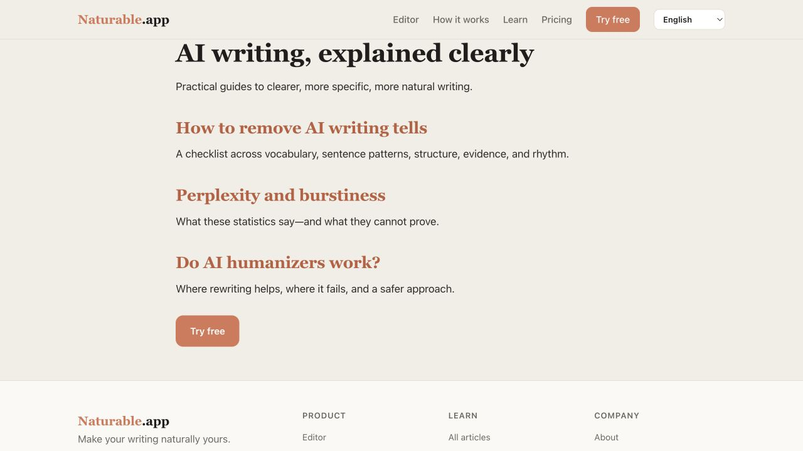
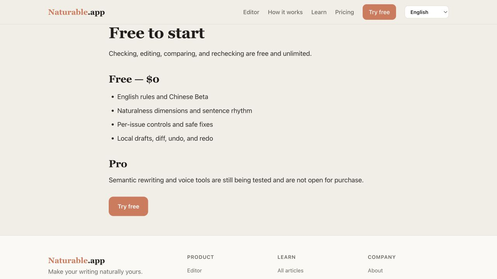
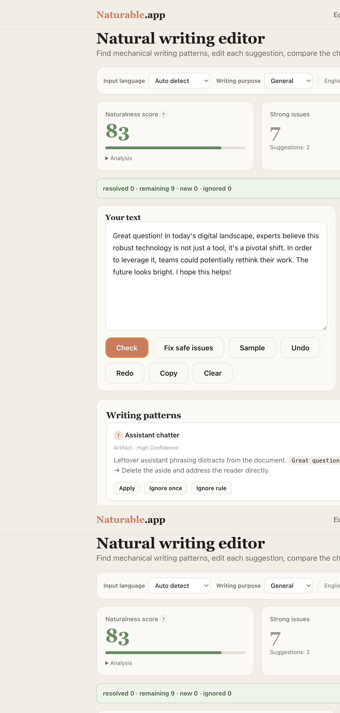
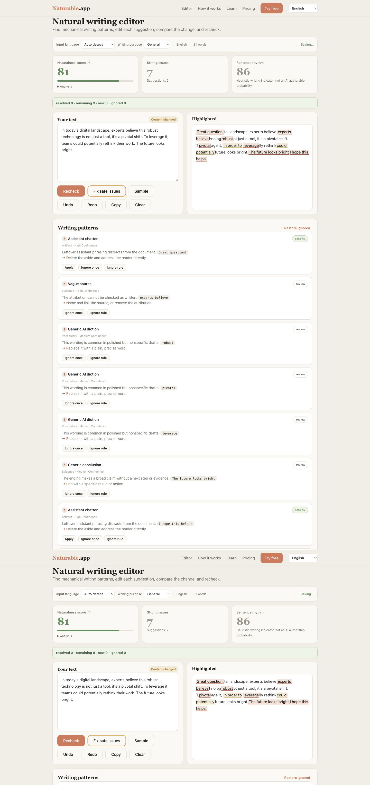
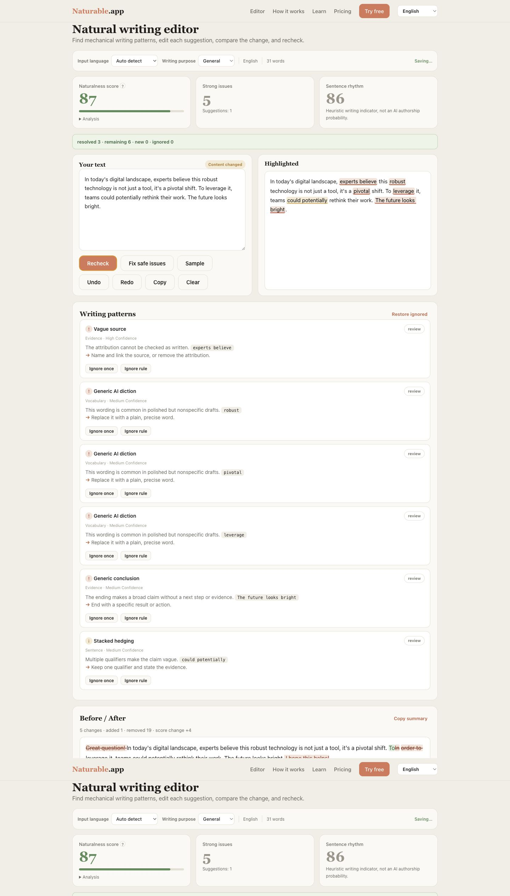

# Naturable Free V2 完成度与线上页面审计

> 审计日期：2026-07-12  
> 审计范围：Free V2 PRD、线上英文编辑闭环、How it works、Learn、Pricing  
> 方法：本轮线上浏览器截图与交互验证、本地代码检查、现有自动测试  
> 结论：功能骨架已完成，但尚未达到 PRD 的正式发布标准

## 1. 总体结论

按 PRD 的用户可见能力和发布验收条件估算：

- **功能骨架完成度：约 65%。** 检查、逐条处理、安全修复、Inline Diff、复检、英文/中文规则入口和本地保存均已出现。
- **正式发布完成度：约 45%。** 核心状态一致性、评分可信度、双语质量、草稿管理、测试深度、响应式和内容页仍未达到验收门槛。
- **内容页成熟度：约 25%。** How it works、Learn、Pricing 线上页面只是短文骨架，信息层级、产品演示、信任证明、转化路径和内容深度均不足。

当前不建议宣称“PRD 已完成”。更准确的状态是：

> Free V2 Alpha 已具备主流程，进入修复核心回归、补齐页面和正式验收阶段。

## 2. 本轮证据

### Step 1 — How it works：可访问，但内容过薄

健康度：**Needs work**

- 页面只有四段说明，不能让用户直观看懂检查、修改、对比和复检。
- 没有真实编辑器截图、规则示例、问题卡片、Before/After 或分数拆解。
- 没有解释 Strong issue 与 Suggestion、severity 与 confidence 的区别。
- 隐私只有一句话，缺少“什么在本地保存、如何删除”的具体说明。
- 页面标题、正文、CTA 形成了基本阅读顺序，语义标题结构正常。

### Step 2 — Learn：可访问，但不像内容中心

健康度：**Needs work**

- 仅三个文字链接，没有卡片、主题分类、阅读时间、更新时间或精选内容。
- 页面没有建立“从识别问题到实际改稿”的学习路径。
- 大面积空白使页面显得未完成，而不是刻意简洁。
- 缺少中文内容入口、英文/中文 Beta 标签及场景化内容。
- 文章标题清楚，链接文字具有描述性，这是当前最好的可访问性基础。

### Step 3 — Pricing：信息存在，但没有形成套餐决策

健康度：**Needs work**

- Free 只有四个 bullet，未完整呈现逐条 Apply/Ignore、Diff、复检、隐私和无需注册等价值。
- Pro 只有一句“测试中”，用户无法理解未来付费边界，也没有 waitlist 或产品更新订阅。
- 没有 Free/Pro 对比矩阵、FAQ、隐私承诺和“不承诺绕过检测器”的信任说明。
- CTA 可见，但页面没有提供足够信息支撑点击决策。

### Step 4 — Check：可运行，但首次结果状态错误

健康度：**At risk**

- 检查能识别 9 个问题，逐条显示解释、证据、建议和操作。
- 首次 Check 就显示 `resolved 0 · remaining 9 · new 0`，与 PRD“复检后才显示状态摘要”不符。
- 7 个 Strong issues 时自然度仍为 83，绿色高分会削弱用户对问题严重程度的信任。
- 页面非常长，同类 `Generic AI diction` 被拆成多张卡片，缺少折叠、筛选和定位效率。
- 高亮可聚焦、问题不是仅靠颜色表达，具备一定可访问性基础。

### Step 5 — Fix + Compare：功能存在，但出现严重中间态错误

健康度：**Broken intermediate state**

- Safe Fix 正确删除了助手寒暄，并把 `In order to` 改为 `To`。
- Before/After 和修改摘要能够生成。
- 旧 issue 区间没有随文本变化刷新，Highlighted 出现错位和拼接乱码。
- 修复后自然度从 83 降到 81，直到复检才变为 87；这让“修改是否有效”在关键时刻给出相反反馈。
- Safe Fix 执行前没有显示预计修改数量，也没有确认步骤。

### Step 6 — Recheck：结果更新，但 Dirty 状态没有复位

健康度：**Partial**

- 复检后问题数量由 9 降到 6，并显示 resolved 3。
- 高亮在复检后恢复正确，Diff 保留正常。
- 复检完成后仍显示 `Content changed`，主按钮仍为 `Recheck`；页面状态与内部 `dirty=false` 不一致。
- `New/Remaining` 依据 rule ID + 命中文本匹配，文本稍有变化时可能把同一问题误判为新增。
- 页面没有默认优先区分 Remaining、New、Resolved 的问题列表。

## 3. PRD 完成度矩阵

| PRD 能力 | 状态 | 审计结论 |
|---|---|---|
| Check → Edit → Compare → Recheck → Copy | 部分完成 | 主流程可走通，但中间态和复检状态有错误 |
| 英文规则正式版 | 部分完成 | 仅 17 条总规则；缺少目标语料 precision 验证 |
| 中文独立规则 Beta | 部分完成 | 有独立中文规则，但数量与测试覆盖不足 |
| 英文/中文 UI | 部分完成 | 路由和语言选择存在；部分中文页面/控件仍依赖运行时替换 |
| 输入语言识别与手动覆盖 | 基本完成 | en、zh、mixed 可识别；低置信度确认未实现 |
| 单处 Apply | 已完成 | 有单项安全修改 |
| Ignore once / Ignore rule / Restore | 已完成 | 操作存在；问题定位与状态展示仍可增强 |
| Fix safe issues | 部分完成 | 可批量修复；缺少预计数量和确认，修复后高亮错位 |
| 50 步 Undo/Redo | 基本完成 | 有历史栈；缺少 DOM 级集成测试 |
| Baseline 与 Inline Diff | 基本完成 | Inline Diff 可用；摘要计数语义较粗 |
| Side-by-side Diff | 未完成 | PRD 桌面端要求，当前只有 Inline |
| Recheck 分类 | 部分完成 | 有 summary；首次检查误显示，Dirty UI 不复位，列表未分类 |
| Writing purpose | 未完成 | 只有选择器，规则权重和阈值未使用 purpose |
| 最近 10 个本地草稿 | 未完成 | 当前只保存一个 localStorage 草稿，无命名、列表或删除全部 |
| IndexedDB 降级策略 | 未完成 | 只有 localStorage |
| Analytics 白名单 | 未发现实现 | 未发现 PRD 事件或 schema |
| 规则反馈 | 未完成 | 无 Helpful / Not helpful / False positive |
| Web Worker 性能架构 | 未完成 | 分析、Diff 和评分均在主线程 |
| 可访问性 | 部分完成 | 语义结构与可聚焦高亮存在；需做键盘、状态通知和响应式实测 |
| 自动化质量门槛 | 未完成 | 当前测试只有少量纯函数断言，无交互、状态、隐私和浏览器测试 |

## 4. P0：正式发布前必须修复

### P0-1 修复修改后的 stale issues

`applyIssue()` 和 `autofix()` 修改正文后继续使用旧 `state.issues` 渲染 Highlight 和 Score。旧 start/end 对新文本已经无效，造成错位高亮和错误分数。

建议：

- 修改后不要用旧 issue 区间渲染当前文本。
- 可以立即重新 scan 当前文本，但保持状态为 Dirty，直到用户显式 Recheck 才生成复检摘要。
- 或在 Dirty 状态隐藏 Highlight，显示“Recheck to refresh highlights”。

### P0-2 修复复检后的 CTA 与 Dirty badge

`analyze()` 把 `state.dirty` 设为 false，但没有同步更新按钮和 badge。

建议将按钮/badge 渲染并入统一 `renderState()`，不要只在 `markDirty()` 中修改 DOM。

### P0-3 首次检查不能显示复检摘要

从本地草稿恢复后，旧 issues 被当作 previous issues，首次点击 Check 生成了 remaining 摘要。

建议显式保存 `hasRechecked` 或 `lastCheckedRevision`，只有用户在 Dirty 状态触发 Recheck 时才计算并显示 summary。

### P0-4 重新校准 Naturalness score

当前按五个维度简单平均，大量 Strong issues 仍可能得到绿色高分；修复后因旧 issues 和文本长度变化还会暂时降分。

建议：

- Artifact 和高置信度 evidence Strong issue 应设置总分上限。
- 分数颜色同时考虑 strong count，而非只看 total。
- 建立固定校准语料，验证分数排序而不是只测试返回范围。

### P0-5 补充真实交互测试

至少增加：

- 首次 Check 不显示 recheck summary。
- 单处 Apply 后不会出现错误区间。
- Safe Fix 后 score 不使用旧 issues。
- Recheck 后按钮回到 Check、Dirty badge 隐藏。
- Resolved/Remaining/New 分类。
- 中文 Apply、Diff、Undo/Redo。
- localStorage 异常降级。
- 正文不进入网络请求和日志。

## 5. 三个粗糙页面的改版方向

### 5.1 How it works

建议改成“产品演示页”，而不是说明文章：

1. Hero：一句定位 + Try free。
2. 四步可视流程：Paste、Check、Edit & compare、Recheck。
3. 真实问题卡片示例：Strong/Suggestion、confidence、safe fix。
4. Before/After 示例。
5. Naturalness 五维评分解释。
6. English 正式版 / 中文 Beta 能力说明。
7. Local-first 隐私流程图。
8. Limitations：不是作者身份判断，不保证第三方检测结果。
9. 底部 CTA。

### 5.2 Learn

建议改成“内容中心”：

1. Featured guide 大卡。
2. 按主题分组：Patterns、Editing、Metrics、Responsible use、中文写作。
3. 每张卡显示摘要、阅读时间、更新时间、语言。
4. 增加场景入口：Email、Academic、Marketing、Chinese writing。
5. 首页至少 6–9 篇内容，避免只有三个链接。
6. 提供 Learn → Editor 的上下文 CTA，例如“用本文示例运行检查”。

### 5.3 Pricing

建议改成“Free 价值确认 + Pro 边界说明”：

1. Free 与 Pro 两张完整计划卡。
2. 功能对比矩阵。
3. Free 明确列出 unlimited local checks、per-issue controls、Diff、Recheck、local drafts、English/Chinese。
4. Pro 标记 Coming later，不展示不可购买的虚假价格。
5. 提供产品更新 waitlist，而不是灰色死按钮。
6. 增加隐私、训练数据、第三方检测器和计费 FAQ。
7. 页面加入简短的 Before/After 产品证据。

## 6. 建议迭代顺序

### Sprint A：核心回归修复

- stale issue/highlight
- Recheck/Dirty 状态
- 首次 summary
- Score 校准
- 集成测试

### Sprint B：三个内容页重做

- 优先 How it works
- 其次 Pricing
- 最后 Learn hub 和新增文章卡
- 同步英文与中文，不再依赖大段运行时 `innerHTML` 替换

### Sprint C：补齐 PRD 未完成项

- Writing purpose 真正影响规则
- 多草稿与 IndexedDB
- Side-by-side Diff
- Rule feedback
- Analytics 白名单与隐私验证
- Web Worker 与性能测试

## 7. 证据限制

- 本轮已验证线上桌面端主要页面和英文核心编辑流程。
- 浏览器在强制移动 viewport 下产生不稳定截图，因此本报告不使用这些移动截图作为响应式结论；移动端仍需用真实设备或稳定浏览器重新验收。
- 截图只能证明可见状态，不能证明完整 WCAG 合规；键盘顺序、屏幕阅读器播报、缩放和颜色对比仍需专项测试。
- 本地 `site/en/*.html` 内容明显比线上页面更丰富，说明本地代码与当前部署产物可能不一致；发布前需要核对 Cloudflare 的实际部署目录和版本。

